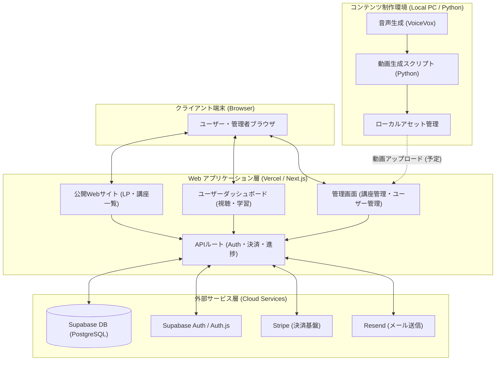

# ClassForge システム構成・機能ブロック図

このドキュメントでは、ClassForge プロジェクトの各機能ブロックの役割、動作環境、および相互の関連性について記述します。

---

## 1. 全体構成図

---

## 2. 機能ブロック詳細

### A. クライアントサイド (ユーザー/管理者端末)
- **動作環境**: PC・スマートフォンのブラウザ
- **役割**: 
    - 講座情報の閲覧
    - 動画プレイヤーによる学習
    - アカウント情報の変更
    - （管理者）講座の作成、セクション・レッスンの編集、売上確認

### B. Web アプリケーション層 (Next.js)
- **動作環境**: Vercel (Edge Runtime / Node.js)
- **主な機能**:
    - **App Router**: ルーティング、サーバーサイドレンダリング (SSR)
    - **Server Actions**: フォーム送信、データ更新処理
    - **API Routes**: Stripe Webhook 受信、進捗データの保存 API
- **認証**: Auth.js (NextAuth v5) を利用したセッション管理

### C. 外部サービス / インフラ
- **Supabase (PostgreSQL)**:
    - 会員情報、講座データ、視聴進捗、購入履歴の保持
    - Prisma ORM を介したアクセス
- **Stripe**:
    - 決済セッションの生成
    - 支払い完了後の Webhook 通知による購入権限の付与
- **Resend**:
    - パスワード再設定メールなどのシステムメール送信

### D. コンテンツ制作環境 (自動化ツール群)
- **動作環境**: ローカル PC (Windows/Mac)
- **主な機能**:
    - **自動動画生成**: スクリプトから講義動画を自動合成
    - **AI 音声合成**: VoiceVox 等を利用したナレーション生成
    - **画像生成**: プロンプトベースの図解・サムネイル生成
- **関連性**: 制作されたアセット（MP4等）は、YouTube 等にアップロードされた後、Webアプリの管理画面から URL として登録されます。

---

## 3. データの流れ (主要フロー)

### 3.1 講座購入フロー
1. ユーザーがブラウザで「購入」をクリック
2. Next.js サーバーが **Stripe Checkout** セッションを作成
3. ユーザーが Stripe 決済画面で支払いを完了
4. Stripe が **Webhook** を送信
5. Next.js サーバーが通知を受け取り、**Supabase** に購入レコードを作成
6. ユーザーに視聴権限が付与される

### 3.2 視聴進捗保存フロー
1. 動画プレイヤー (YouTube Iframe) が再生時間を監視
2. 30秒ごとにブラウザから **APIルート** へ進捗データを送信
3. サーバーが **Supabase** の `Progress` テーブルを更新
4. マイページに最新の進捗率が表示される

### 3.3 コンテンツ登録フロー (制作〜公開)
1. ローカル環境で **Python スクリプト** が動画を生成
2. 動画をホスティング先 (YouTube等) へアップロード
3. 管理者が **管理画面** から動画 URL と説明文を入力
4. **Supabase** にレッスン情報が保存され、即時に受講生へ公開される
